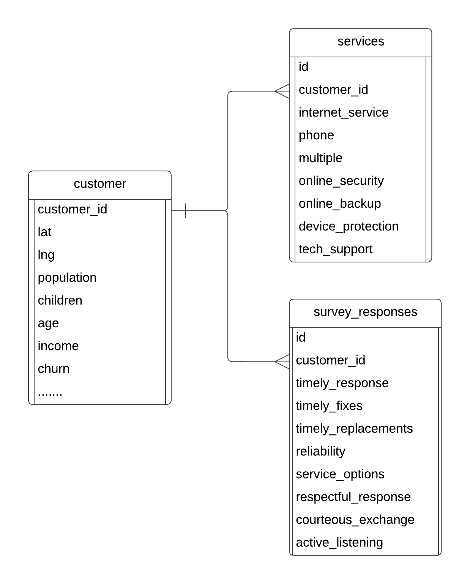

# D205 Report 
Landen Bailey -- MSDA

## A: Business Question
How important are sufficient plan options to our customer base, particularly for those that left us? <br>  And how many people that emphasize a need for sufficient plan options take full advantage of the options we already offer?
*** 

## B: Aquire the Data

### Current Data Locations
The data I will need in order to answer this question will be the customers table already in the database, The survey data from the csv add on, and the services data from the add on. In the lab environment the services data and the survey data were already separated nicely into two separate csv files. We will use these two files and import all of their columns into the database so as to fulfill the logical model defined in this diagram: 


### Bringing the Data together
The two external reports [Services.csv](Services.csv) and [Survey_Responses.csv](Survey_Responses.csv) (found in this report directory) represent additional data to expand upon the data already available in the [postgres database:](churn.sql) churn.sql. In order to make them more useful we will realize the logical diagram above and bring the csv tables (with some slight transformations) into the postgres database. First we will create a new table for each dataset and link those tables to the customers table, then we will load the data from the csvs into the tables we created for an initial load.

### Create tables:
#### Services Table
```
CREATE TABLE public.services
(
    id serial NOT NULL,
    customer_id text NOT NULL,
    internet_service text,
    phone boolean NOT NULL default False,
    multiple boolean NOT NULL default False,
    online_security boolean NOT NULL default False,
    online_backup boolean NOT NULL default False,
    device_protection boolean NOT NULL default False,
    tech_support boolean NOT NULL default False,
    PRIMARY KEY (id),
    CONSTRAINT cust_id_fk FOREIGN KEY (customer_id)
        REFERENCES public.customer (customer_id) MATCH SIMPLE
        ON UPDATE NO ACTION
        ON DELETE CASCADE
        NOT VALID
);
```
#### Survey Responses Table
```
CREATE TABLE public.survey_responses
(
    id serial NOT NULL,
    customer_id text NOT NULL,
    timely_response smallint NOT NULL,
    timely_fixes smallint NOT NULL,
    timely_replacements smallint NOT NULL,
    reliability smallint NOT NULL,
    service_options smallint NOT NULL,
    respectful_response smallint NOT NULL,
    courteous_exchange smallint NOT NULL,
    active_listening smallint NOT NULL,
    PRIMARY KEY (id),
    CONSTRAINT cust_id_fk FOREIGN KEY (customer_id)
        REFERENCES public.customer (customer_id) MATCH SIMPLE
        ON UPDATE NO ACTION
        ON DELETE CASCADE
        NOT VALID
);
```
### Load Data into tables:
#### Services Data Load
```
COPY services(customer_id, internet_service, phone, multiple, 
	online_security, online_backup, device_protection, tech_support)
from program 'sed "s/Yes/True/g" /Users/landenbailey/wgu/d205/Services.csv | sed "s/None//g" | sed "s/No/False/g"'
DELIMITER ','
CSV HEADER;
```
#### Survey Responses Data Load
```
Copy survey_responses(customer_id, timely_response, timely_fixes,
    timely_replacements, reliability, service_options,
    respectful_response, courteous_exchange, active_listening) 
from '/Users/landenbailey/wgu/d205/Survey_Responses.csv'
DELIMITER ','
CSV HEADER;
```
This will load all of the data from the csv into the database, ready for us to now query and analyze. Those tables will remain in the database permanently, but the copy over of the datasets was a one time command, and any refreshing of that data will not happen automatically.
***

## C: Analyze the Data
### Survey Responses
The first goal of our business question is to understand the importance of Service Options to the customers that left us. The base metric to understand this is simple to find because we have survey data where they told us exactly how important it is to them. 
<br>
Using this query we can see the churned groups responses to the question of "How important are different service options to you?" in these results: 
```select s.service_options, count(*)
from survey_responses s
join customer c on s.customer_id=c.customer_id
where c.churn = 'Yes'
group by 1 order by 1;
```
| Most to Least Important | Number of People who churned |
| ----------------------- | ---------------------------- |
| 1                       | 57                           |
| 2                       | 371                          |
| 3                       | 917                          |
| 4                       | 896                          |
| 5                       | 362                          |
| 6                       | 46                           |
| 7                       | 1                            |
| 8                       | 0                            |

This is great, and those numbers are definitely weighed toward the lower end of the spectrum indicating a high level of importance on this business metric, but those figures don't mean a whole lot without something else to compare them against. 
<br>So lets compare against the customer population who didn't churn to see if service options are more important for those who churned than they are for all the other customers in general. Then lets take a look at these figures compared against the other survey question responses to get an idea of how important service options are over other important qualities of service.

### Comparison between Populations
[This query here](percent_compare.sql) gives what percent of the either churned or unchurned population that responded to the indicated question with the indicated value. The results being a little larger can be viewed [here in this file](percent_comp_results.csv). This data comfirms that the churned population does place higher emphasis on the value of service options than the non-churned population. The percentages of churned customers answering with values of 1 and 2 to the service options question was higher than the percentage of non-churned customers. Likewise higher percentages of non-churned customers answered values of 4 and greater. The turn around point of equality was in value 3 which reported the same percentage of respondants regardless of churn status. So while Service Options are very important for all customers. They are more extremely important for the customer group that ended up churning. 

### Comparison between Questions
Service Options was one of three question on this survey that saw a higher skew of importance for those customers that did churn compared to those that didn't. [This query](high_end_comp.sql) and [these results](high_end_comp.csv) show that timely fixes and timely replacements also skewed more important for the churned. The rest of the questions were either the same, or less important. Another analysis should probably investigate the effect of timely responses and replacements on churn. But for now we will continue investigating the effect Service Options has on it.    
<br>Looking at just the churned population now lets create a ranking of which business attributes were marked as most important the most often. We will use a variety of calculations to show this including mean, mode, and count (to simulate median).
These are the queries we will run for each of those metrics:

#### Mean Ranking---------------------
``` 
with averages as (
    select round(avg(timely_response), 2) as timely_response, 
    round(avg(timely_fixes), 2) as timely_fixes,
    round(avg(timely_replacements), 2) as timely_replacements,
    round(avg(reliability), 2) as reliability,
    round(avg(service_options), 2) as service_options, 
    round(avg(respectful_response), 2) as respectful_response,
    round(avg(courteous_exchange), 2) as courteous_exchange, 
    round(avg(active_listening), 2) as active_listening
    from survey_responses s
    join customer c on s.customer_id=c.customer_id
    where c.churn = 'Yes'
)
SELECT
   unnest(array['timely_response', 'timely_fixes', 'timely_replacements', 'reliability', 'service_options', 'respectful_response', 'courteous_exchange', 'active_listening']) AS "Questions",
   unnest(array[timely_response, timely_fixes, timely_replacements, reliability, service_options, respectful_response, courteous_exchange, active_listening]) AS "Mean"
FROM averages
ORDER BY 2;
```
These means are rounded to the 2nd decimal place, which if anything is excessive exactness for the kind of data we are looking at, but for this comparison it proved essential to see that by a slight hair, Service Options has the highest amount of importance placed on it by churned customers in this survey.
| Question            | Average Response Value |
| ------------------- | ---------------------- |
| service_options     | 3.48                   |
| reliability         | 3.5                    |
| timely_replacements | 3.5                    |
| active_listening    | 3.51                   |
| courteous_exchange  | 3.51                   |
| timely_response     | 3.52                   |
| timely_fixes        | 3.53                   |
| respectful_response | 3.54                   |

#### Mode Ranking---------------------
``` 
select mode() WITHIN GROUP (ORDER BY timely_response) as timely_response, 
mode() WITHIN GROUP (ORDER BY timely_fixes) as timely_fixes,
mode() WITHIN GROUP (ORDER BY timely_replacements) as  timely_replacements,
mode() WITHIN GROUP (ORDER BY reliability) as reliability,
mode() WITHIN GROUP (ORDER BY service_options) as service_options, 
mode() WITHIN GROUP (ORDER BY respectful_response) as respectful_response,
mode() WITHIN GROUP (ORDER BY courteous_exchange) as courteous_exchange, 
mode() WITHIN GROUP (ORDER BY active_listening) as active_listening
from survey_responses s
join customer c on s.customer_id=c.customer_id
where c.churn = 'Yes';
```
3 of the questions in this survey reported mode values of 3 while the rest all reported 4. Those three were Service Options, Respectful Reponse, and Courteous Exchange. Respectful Response and Courteous Exchange are shown here to be very important attributes, but were previously reported to being even more important to the population that didn't churn, so their effect on churn with regards to how our company performs in those attributes is if anything negative and therefore inconsequential to this analysis. Service Options presence at the top again in this metric provides further proof of its importance however.

#### Count Ranking---------------------
In order to only focus on the responses representing greatest importance we will filter down the dataset to only include response values of 3 or lower for these cumulative counts. The following query reports the total number of responses that listed each question as having an importance of 3 or lower:
``` 
select sum(case when timely_response in (1, 2, 3) then 1 else 0 end) as timely_response,
sum(case when timely_fixes in (1, 2, 3) then 1 else 0 end) as timely_fixes,
sum(case when timely_replacements in (1, 2, 3) then 1 else 0 end) as timely_replacements,
sum(case when reliability in (1, 2, 3) then 1 else 0 end) as reliability,
sum(case when service_options in (1, 2, 3) then 1 else 0 end) as service_options,
sum(case when respectful_response in (1, 2, 3) then 1 else 0 end) as respectful_response,
sum(case when courteous_exchange in (1, 2, 3) then 1 else 0 end) as courteous_exchange,
sum(case when active_listening in (1, 2, 3) then 1 else 0 end) as active_listening
from survey_responses s
join customer c on s.customer_id=c.customer_id
where c.churn = 'Yes';
```
These results again mark Service Options as the most important attribute among the list for the population of churned customers as it recieves the highest count of responses at 1345. The next best is 25 responses lower and the average of all the other questions over 30 lower. 


### Service Options
Lets investigate further into these 1345 customers that left the company after expressing the great importance of having a good variety of service options to choose from. The following query will report percentages of users that take advantage of the different plan options broken down by option and also by population. The first poulation being the 1345 customers reporting great importance of service options and then churning, and the second population being every one in the database. 
```
select 'Churned and Important' as Population,
(sum(case when internet_service = 'Fiber Optic' then 1 else 0 end)/13.45)::int as fiber_internet_service,
(sum(case when internet_service = 'DSL' then 1 else 0 end)/13.45)::int as DSL_internet_service,
(sum(case when phone then 1 else 0 end)/13.45)::int as phone,
(sum(case when multiple then 1 else 0 end)/13.45)::int as multiple,
(sum(case when online_security then 1 else 0 end)/13.45)::int as online_security,
(sum(case when online_backup then 1 else 0 end)/13.45)::int as online_backup,
(sum(case when device_protection then 1 else 0 end)/13.45)::int as device_protection,
(sum(case when tech_support then 1 else 0 end)/13.45)::int as tech_support
from services s
join customer c on c.customer_id=s.customer_id
join survey_responses r on r.customer_id=c.customer_id
where c.churn = 'Yes' and r.service_options in (1, 2, 3)
union
select 'Everyone' as Population,
(sum(case when internet_service = 'Fiber Optic' then 1 else 0 end)/100.0)::int as fiber_internet_service,
(sum(case when internet_service = 'DSL' then 1 else 0 end)/100.0)::int as DSL_internet_service,
(sum(case when phone then 1 else 0 end)/100.0)::int as phone,
(sum(case when multiple then 1 else 0 end)/100.0)::int as multiple,
(sum(case when online_security then 1 else 0 end)/100.0)::int as online_security,
(sum(case when online_backup then 1 else 0 end)/100.0)::int as online_backup,
(sum(case when device_protection then 1 else 0 end)/100.0)::int as device_protection,
(sum(case when tech_support then 1 else 0 end)/100.0)::int as tech_support
from services s
join customer c on c.customer_id=s.customer_id
join survey_responses r on r.customer_id=c.customer_id
;
```
[Results:](service_usage.csv) service_usage.csv <br>

The results of this query show little to no difference between the general populations use of the plans available and the population that declared its great importance and still left. This means primarily that those who left didn't leave because they wanted better options, but were unaware that we offered better options. They just wanted better options we still didn't offer. The one minor exception to this pointed out in this query is that a considerably lower portion of those who wanted better service options made use of the faster internet package. 

### Results and Recomendations
Service Options are one of the most important business attributes for all of our customers, even more so for the group of customers that churned due to the fact that over half of those that churned had reported that service options were of greatest importance to them. The data indicates that a small number of these that left might have done so because they were unaware of our faster internet options. The greater majority of those who left however did so because they wanted more options of plans that we are unable to offer at the moment. To aid in mitigating future churn from these same sectors, marketing should advise current customers on the slower internet plans of our faster options, and exploration of additional plan options should be prioritized. 
***

## D: Further Data Collection and Aggregation
The critical factor in this analysis was the indication of which customers had churned within the last month. It will also be assumed that plan options are only updated every monthly billing cycle and that the surveys are not distributed and collected on a more frequent basis than monthly. With this knowledge the most suitable rate at which to import the updated data and renew this analysis is ***once a month***. That rate will maintain our analysis up to date and accurate as far as is possible and also save on any unnesecary processing costs from engineers. 
***

## Import Script
In order to aid the proccess of importing this data again in the future, the following sql script has been produced combining different aspects of queries previously run: [import_script.sql](import_script.sql)
```
CREATE TABLE IF NOT EXISTS public.services
(
    id serial NOT NULL,
    customer_id text NOT NULL,
    internet_service text,
    phone boolean NOT NULL default False,
    multiple boolean NOT NULL default False,
    online_security boolean NOT NULL default False,
    online_backup boolean NOT NULL default False,
    device_protection boolean NOT NULL default False,
    tech_support boolean NOT NULL default False,
    PRIMARY KEY (id),
    CONSTRAINT cust_id_fk FOREIGN KEY (customer_id)
        REFERENCES public.customer (customer_id) MATCH SIMPLE
        ON UPDATE NO ACTION
        ON DELETE CASCADE
        NOT VALID
);
TRUNCATE services;

CREATE TABLE IF NOT EXISTS public.survey_responses
(
    id serial NOT NULL,
    customer_id text NOT NULL,
    timely_response smallint NOT NULL,
    timely_fixes smallint NOT NULL,
    timely_replacements smallint NOT NULL,
    reliability smallint NOT NULL,
    service_options smallint NOT NULL,
    respectful_response smallint NOT NULL,
    courteous_exchange smallint NOT NULL,
    active_listening smallint NOT NULL,
    PRIMARY KEY (id),
    CONSTRAINT cust_id_fk FOREIGN KEY (customer_id)
        REFERENCES public.customer (customer_id) MATCH SIMPLE
        ON UPDATE NO ACTION
        ON DELETE CASCADE
        NOT VALID
);
TRUNCATE survey_responses;

COPY services(customer_id, internet_service, phone, multiple, 
	online_security, online_backup, device_protection, tech_support)
from program 'sed "s/Yes/True/g" /Users/landenbailey/wgu/d205/Services.csv | sed "s/None//g" | sed "s/No/False/g"'
DELIMITER ','
CSV HEADER;

Copy survey_responses(customer_id, timely_response, timely_fixes,
    timely_replacements, reliability, service_options,
    respectful_response, courteous_exchange, active_listening) 
from '/Users/landenbailey/wgu/d205/Survey_Responses.csv'
DELIMITER ','
CSV HEADER;
```
This script can be run with this simple command from the command line:
``` 
psql -U landenbailey -d d205 -a -f /Users/landenbailey/wgu/d205/import_script.sql 
```
